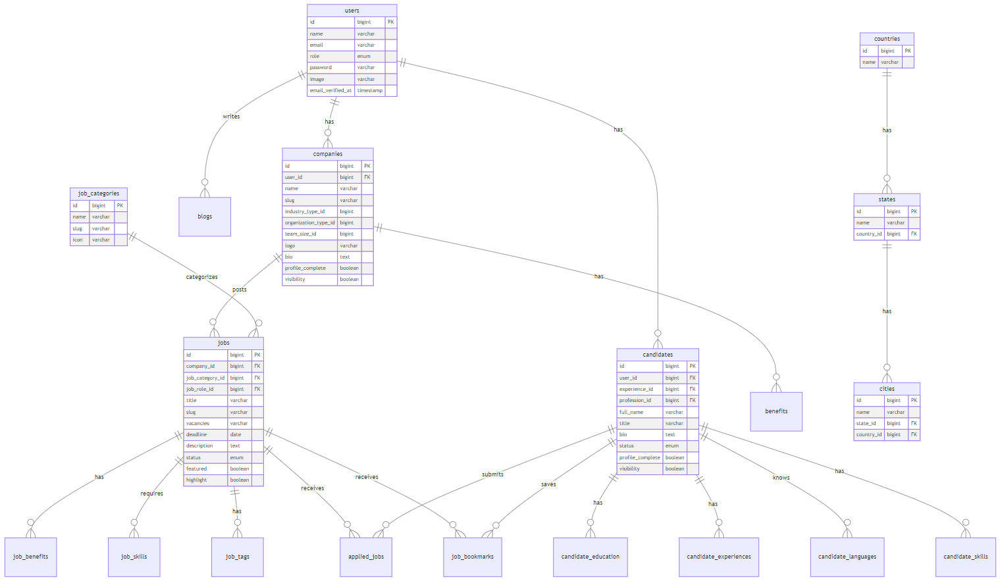
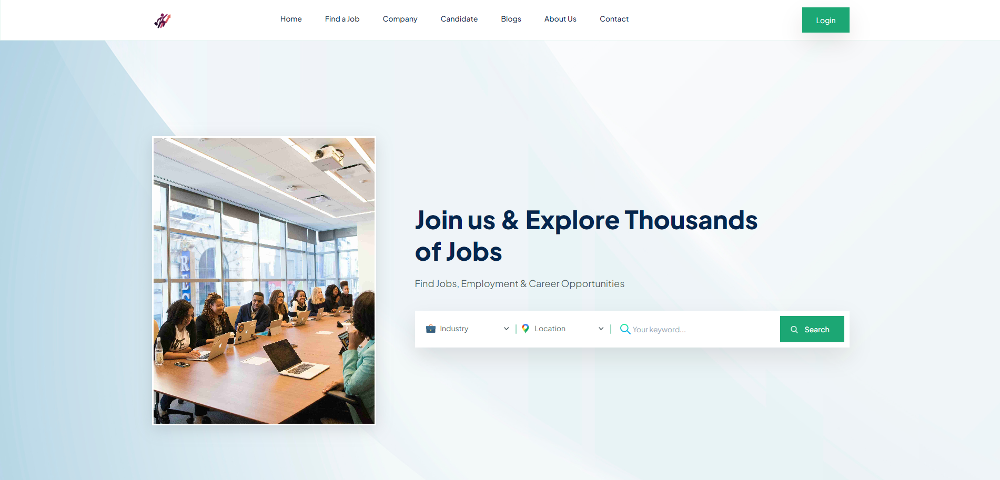
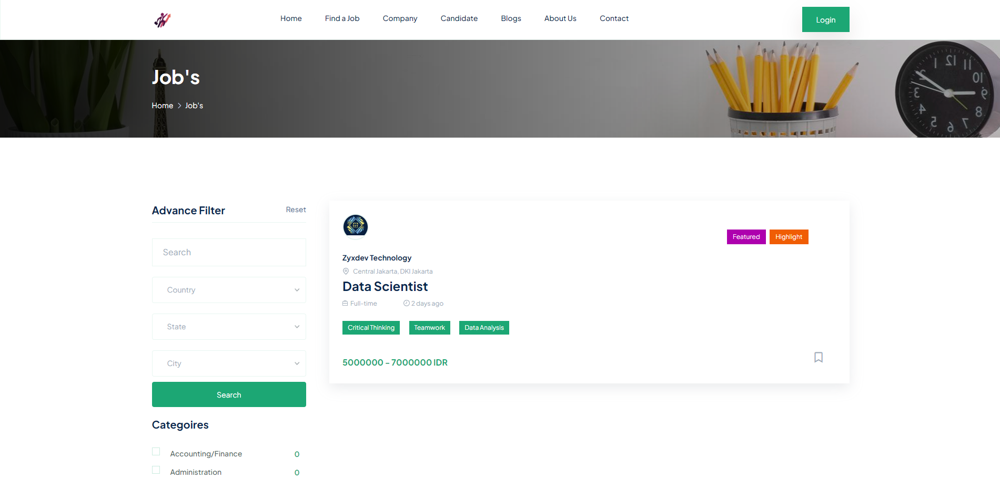
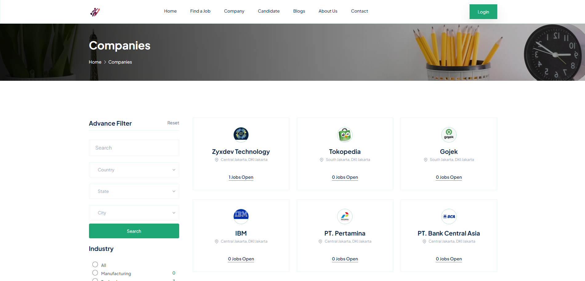
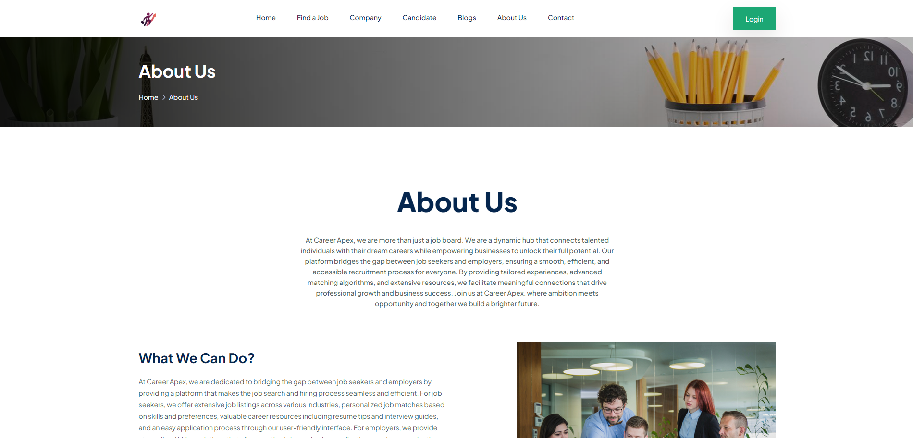
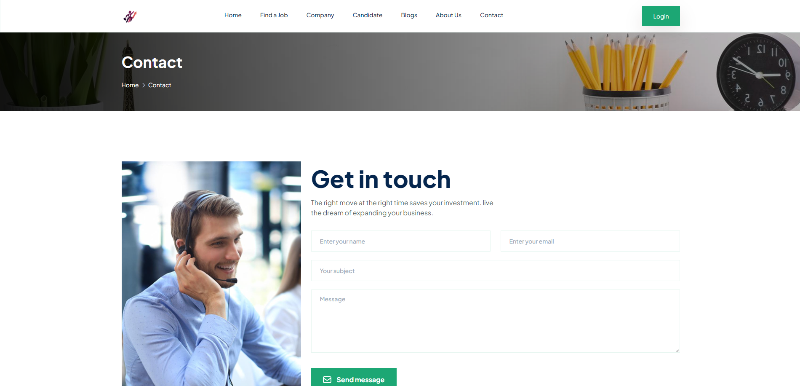
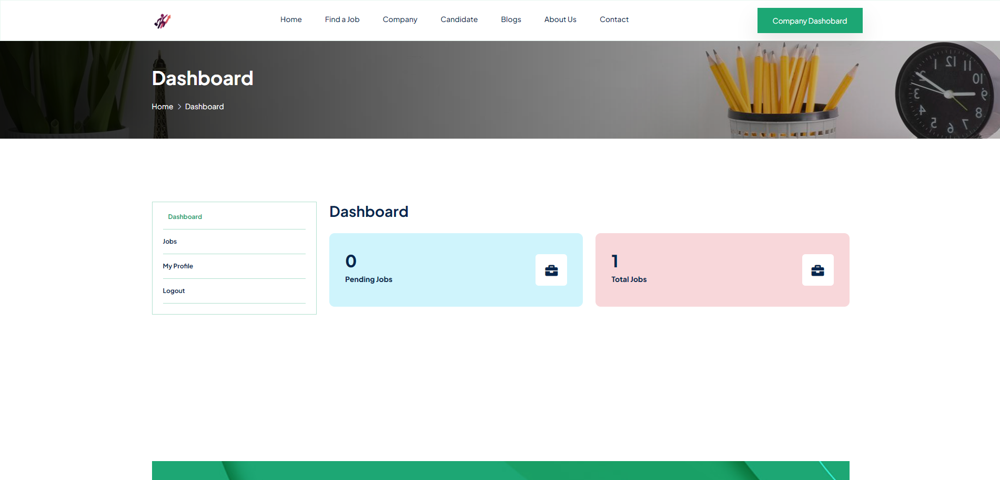
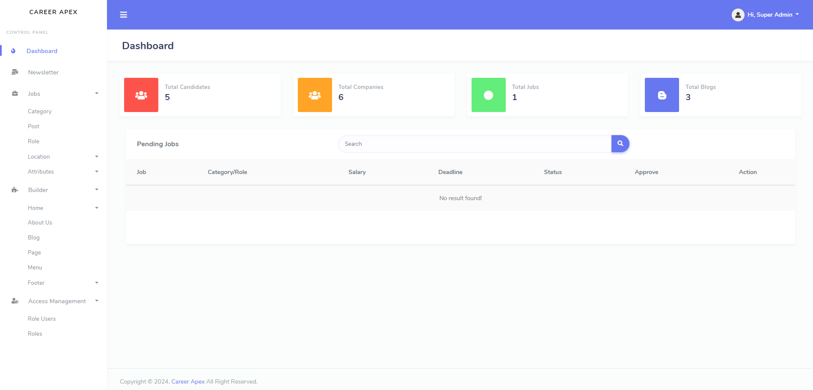

# Career Apex

## 📋 Project Overview

Career Apex is a cutting-edge job matching platform that revolutionizes the traditional recruitment process by leveraging technology to create meaningful connections between job seekers and employers. Built with Laravel 11, this platform represents a significant step forward in modernizing the employment ecosystem.

### Vision
To create an inclusive digital employment ecosystem that democratizes access to career opportunities while promoting sustainable economic growth through efficient job matching and skill development.

### Mission
- Bridge the gap between talent and opportunity through innovative technology
- Facilitate meaningful employment connections
- Support economic growth through efficient labor market operations
- Promote decent work conditions and fair employment practices

## 🎯 SDG 8: Decent Work and Economic Growth

Career Apex directly supports SDG 8 (Decent Work and Economic Growth) through various strategic implementations:

### Economic Growth Promotion
- **Digital Transformation**: Accelerating the digitalization of recruitment processes, reducing costs and increasing efficiency
- **Market Efficiency**: Optimizing job matching through AI-powered algorithms, reducing unemployment periods
- **Resource Optimization**: Streamlining the hiring process, saving both time and resources for companies and job seekers

### Decent Work Support
- **Transparency**: Mandatory salary information and clear job descriptions to promote fair compensation
- **Equal Opportunities**: Blind application features to reduce bias in initial screening
- **Skills Development**: Integrated learning resources and skill assessment tools
- **Quality Employment**: Focus on formal sector jobs with proper benefits and worker protections

### Economic Inclusion
- **Geographic Reach**: Remote work options and location-flexible positions
- **Accessibility**: Mobile-responsive design for users with limited computer access
- **Diverse Opportunities**: Various employment types from entry-level to executive positions

## 🌐 Link Attachment
- Website : https://careerapex.komaraip.com/
- Presentation : -

## 📝 Admin Login
- Link : https://careerapex.komaraip.com/admin/login
- Email : admin@careerapex.com
- Password : admin123

## 🛠 Tech Stack
- HTML5
- CSS3
- JavaScript
- PHP v8.2
- Laravel v11
- MySQL

## 🚀 Installation

```bash
# Clone repository
git clone https://github.com/komaraip/career-apex.git

# Install dependencies
composer install
npm install

# Configure environment
cp .env.example .env
php artisan key:generate

# Set up database
php artisan migrate
php artisan db:seed

# Start development server
php artisan serve
```

## ⭐ Platform Features

### Authentication System
- Multi-role authentication (Admin/Company/Candidate)
- Role-based access control
- Custom permission management

### Job Management
- Dynamic job posting
- Custom fields support
- Multiple categories
- Advanced search filters

### Dynamic Content
- Custom page builder
- Blog management
- Newsletter system
- Testimonial module

### System Administration
- Menu builder with drag & drop
- Dynamic settings module
- Social media integration
- Multi-image upload system

## ⭐ User Features 

### For Job Seekers
- Portfolio showcase
- Multi-parameter filtering
- Location-based search
- Remote work filter
- Industry-specific searches

### For Employers
- Multi-location posting
- Template management
- Bulk posting capabilities

## 📊 Database Structure


## 🏢 Website Structure

### Public Pages
1. **Homepage**
   - Popular and featured job listings
   - Quick search functionality
   - Latest blog posts
   - Review from clients
   - Newsletter
   

2. **Job**
   - Advanced filtering
   - Location-based search
   - Industry categorization
   

3. **Companies**
   - Company information
   - Active job listings
   

3. **Candidates**
   - Candidate information
   - Available candidate listings
   

3. **Blogs**
   - News or article about jobs
   - Featured blog listings
   
  
3. **About Us**
   - Job portal website information
   

3. **Contact**
   - Contact information
   

### Dashboard Areas

#### Candidate Dashboard
- Analytics dashboard
- Profile management
- Job application tracking
- Saved jobs


#### Company Dashboard
- Analytics dashboard
- Company profile management
- Job posting management
- Applicant tracking


#### Admin Dashboard
- Analytics dashboard
- User management
- Content moderation
- System settings


## 👥 Team Members & Contributions
- **Komara Indra Putra** (Team Leader)
  - Authentication system
  - Role & permission management
  - Admin dashboard
  - Front-end page (Jobs, Company, Candidate)
- **Ahmad Haikal Kamil Shahab**
  - Jobs Management
  - Company Dashboard
- **Zaky Fajri Rosmansah**
  - Page builder systemn
  - Newsletter system
- **Zarin Nurullayla**
  - Candidate dashboard
  - Front-end page (Home Blogs, About, Contact)

### 📝 THANK YOU
This project is published. Explore the Project - [CAREER APEX](https://careerapex.komaraip.com/).
