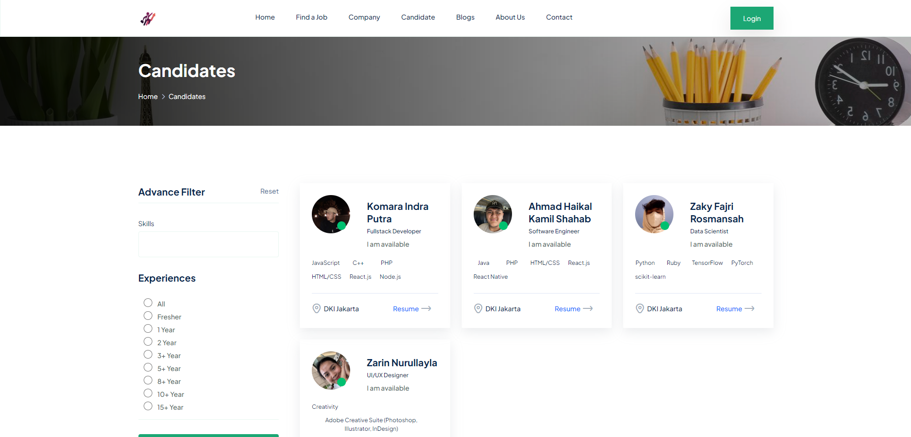
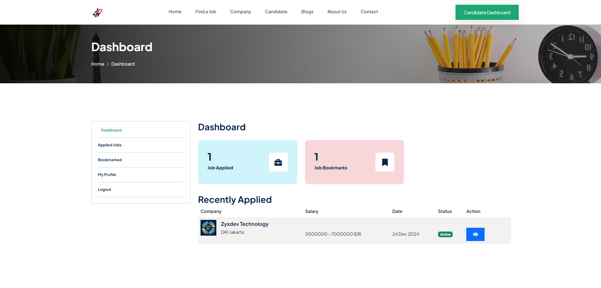

# Career Apex

## 📋 Project Overview

Career Apex is a cutting-edge job matching platform that revolutionizes the traditional recruitment process by leveraging technology to create meaningful connections between job seekers and employers. Built with Laravel 11, this platform represents a significant step forward in modernizing the employment ecosystem.

## 🎯 SDG 8: Decent Work and Economic Growth

Career Apex mendukung SDG 8 (Decent Work and Economic Growth) melalui berbagai strategi. Dengan mempercepat digitalisasi dalam rekrutmen, dan menyederhanakan proses perekrutan, kami mendorong pertumbuhan ekonomi, mengurangi biaya, dan meningkatkan efisiensi untuk perusahaan dan pencari kerja.
- Untuk Decent Work, memastikan transparansi dengan informasi gaji wajib dan deskripsi pekerjaan yang jelas.
- Untuk Economic Growth, menawarkan opsi kerja jarak jauh, posisi fleksibel lokasi, dan  menyediakan berbagai peluang, mencakup berbagai jenis pekerjaan dari tingkat pemula hingga posisi eksekutif.

## 🌐 Link Attachment
- Website : https://careerapex.komaraip.com/

## 📝 Admin Login
- Link : https://careerapex.komaraip.com/admin/login
- Email : admin@careerapex.com
- Password : admin123

## 🛠 Tech Stack
- HTML5
- CSS3
- JavaScript
- PHP v8.2
- Laravel v11
- MySQL

## 🚀 Installation

```bash
# Clone repository
git clone https://github.com/komaraip/career-apex.git

# Install dependencies
composer install
npm install

# Configure environment
cp .env.example .env
php artisan key:generate

# Set up database
php artisan migrate
php artisan db:seed

# Start development server
php artisan serve
```

## ⭐ Platform Features

### Authentication System
- Multi-role authentication (Admin/Company/Candidate)
- Role-based access control
- Custom permission management

### Job Management
- Dynamic job posting
- Custom fields support
- Multiple categories
- Advanced search filters

### Dynamic Content
- Custom page builder
- Blog management
- Newsletter system
- Testimonial module

### System Administration
- Menu builder with drag & drop
- Dynamic settings module
- Social media integration
- Multi-image upload system

## ⭐ User Features 

### For Job Seekers
- Portfolio showcase
- Multi-parameter filtering
- Location-based search
- Remote work filter
- Industry-specific searches

### For Employers
- Multi-location posting
- Template management
- Bulk posting capabilities

## 📊 Database Structure


## 🏢 Website Structure

### Public Pages
1. **Homepage**
   - Popular and featured job listings
   - Quick search functionality
   - Latest blog posts
   - Review from clients
   - Newsletter
   

2. **Job**
   - Advanced filtering
   - Location-based search
   - Industry categorization
   

3. **Companies**
   - Company information
   - Active job listings
   

3. **Candidates**
   - Candidate information
   - Available candidate listings
   

3. **Blogs**
   - News or article about jobs
   - Featured blog listings
   
  
3. **About Us**
   - Job portal website information
   

3. **Contact**
   - Contact information
   

### Dashboard Areas

#### Candidate Dashboard
- Analytics dashboard
- Profile management
- Job application tracking
- Saved jobs


#### Company Dashboard
- Analytics dashboard
- Company profile management
- Job posting management
- Applicant tracking


#### Admin Dashboard
- Analytics dashboard
- User management
- Content moderation
- System settings


## 👥 Team Members & Contributions
- **Komara Indra Putra** (Team Leader)
  - Authentication system
  - Role & permission management
  - Admin dashboard
  - Front-end page (Jobs, Company, Candidate)
- **Ahmad Haikal Kamil Shahab**
  - Jobs Management
  - Company Dashboard
- **Zaky Fajri Rosmansah**
  - Page builder systemn
  - Newsletter system
- **Zarin Nurullayla**
  - Candidate dashboard
  - Front-end page (Home Blogs, About, Contact)

### 📝 THANK YOU
This project is published. Explore the Project - [CAREER APEX](https://careerapex.komaraip.com/).
